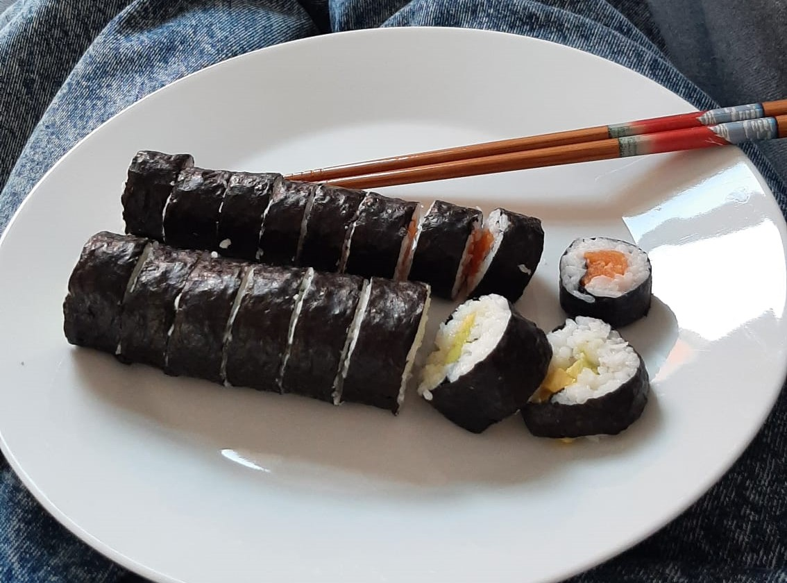

## Zutaten (2 Rollen)

| Menge  | Zutat        |
| ------ | ------------ |
| 100 g  | Sushireis    |
| 130 ml | Wasser       |
| Schuss | Reisessig    |
| Prise  | Salz         |
| 100 g  | Avocado      |
| 2      | Algenblätter |

## Zubereitung

1. Sushireis waschen und mit Wasser in Topf
2. Aufkochen lassen, 15 min köcheln lassen
3. 10 min abkühlen lassen
4. Mit Reisessig und Salz würzen
5. Algenblätter auslegen, zuerst mit Reis, dann mit Avocado belegen und einrollen