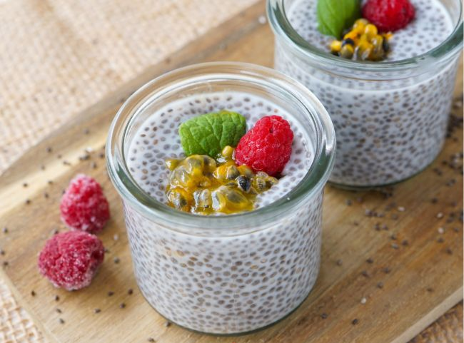

## Zutaten (2 Portionen)

| Menge  | Zutat      |
| ------ | ---------- |
| 30 g   | Chiasamen  |
| 250 ml | Kokosdrink |
|        | Deko       |

## Zubereitung

1. Verteile die Chiasamen auf 2 Gläser. Gieße die Kokosmilch darauf und verrühre sie mit den Samen. Lasse sie 30 Minuten stehen und verrühre sie nochmal.
2. Gib den Chia Pudding über Nacht oder für mindestens 6 Stunden in den Kühlschrank.
3. Verziere ihn dann mit den Toppings deiner Wahl. Im Bild sieht du Minze, Maracuja und Himbeeren.