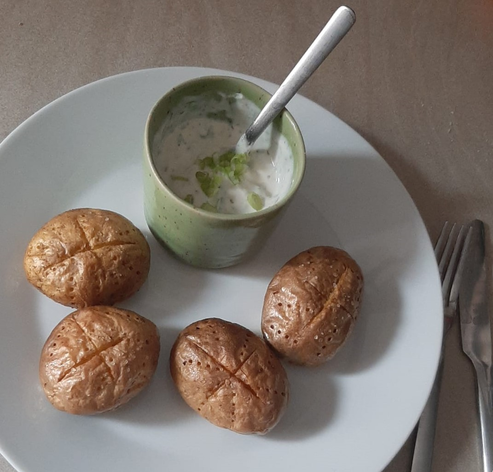

## Zutaten (1 Portion)

| Menge | Zutaten     |
| ----- | ----------- |
| 300 g | Kartoffeln  |
| 100 g | Quark       |
| 1 TL  | Dillspitzen |
| Prise | Knoblauch   |
| Prise | Salz        |

## Zubereitung

1. Kartoffeln oben anschneiden, mit Gabel aufstechen
2. Bisschen mit Öl bestreichen
3. Bei 200°C Umluft 45 min im Ofen braten
4. Dill, Knoblauch und andere Gewürze in den Quark mischen