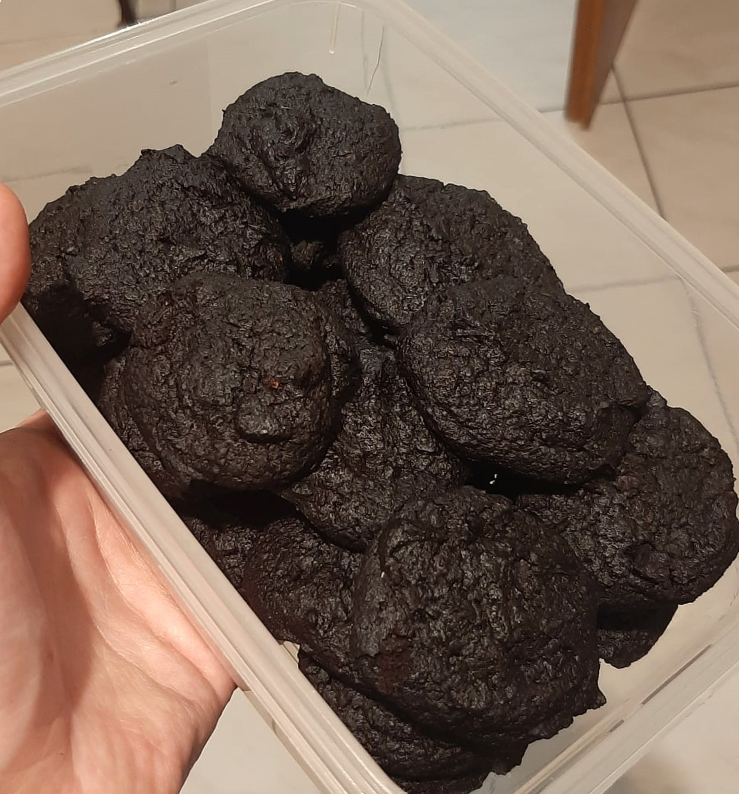

## Zutaten (30 Stück)

|   Menge | Zutat           |
| ------: | --------------- |
|   200 g | [[Kürbispüree]] |
|    90 g | Kakaopulver     |
|   200 g | Birkenzucker    |
|    75 g | Margarine       |
|  1/2 TL | Backpulver      |
| 1 Prise | Salz            |

## Zubereitung  
  
1. Alle Zutaten in eine große Schüssel geben.  
2. Mit einem Teigschaber oder Löffel verrühren, bis ein klebriger Teig entsteht.  
3. Teig **1 Stunde kühlen** (wichtig für Konsistenz und bessere Formbarkeit).  
4. Ofen vorheizen auf 160 °C Umluft
5. Teig in kleinen Portionen (ca. 2 TL pro Cookie) abstechen – ergibt ca. 30 Cookies.  
6. Zu Kugeln rollen und leicht flach drücken.  
   -> Falls der Teig klebt: Hände leicht anfeuchten oder mit Kakao bestäuben.  
7. Optional: etwas grobes Salz oben drauf streuen.  
8. 15 Minuten backen bei 160 °C Umluft

Quelle: https://cheatdaydesign.com/low-calorie-cookies/#mv-creation-143-jtr