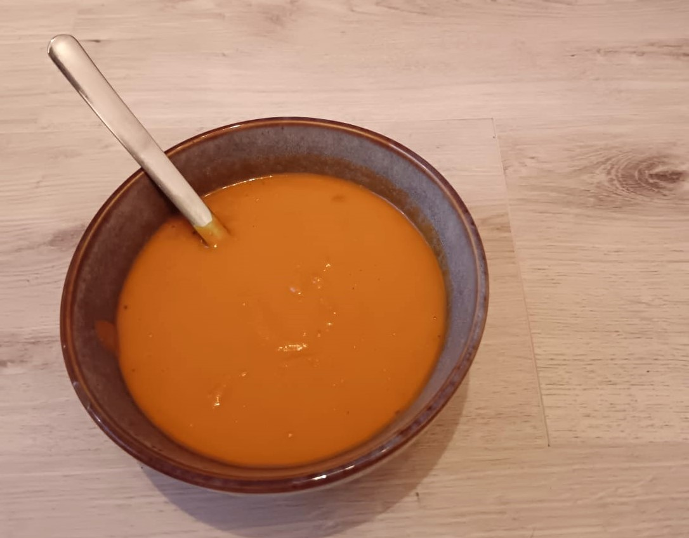

## Zutaten

| Menge | Zutat                     |
| ----- | ------------------------- |
| 550 g | Hokkaido-Kürbis           |
| 250 g | Mehligkochende Kartoffeln |
| 100 g | Sellerie                  |
| 700ml | Wasser                    |
| 2 EL  | Tomatenmark               |
| 1     | Zwiebel                   |
|       | Paprikapulver             |
|       | Knoblauch                 |
|       | Salz                      |
|       | Pfeffer                   |
|       | Kurkuma                   |

## Zubereitung

1. Gemüse in Würfel schneiden.
2. Nun brätst du in einem großen Topf deine Zwiebel oder den Lauch in etwas Öl glasig an. 
3. Anschließend gibst du das Suppengemüse und die Kartoffeln hinzu und gießt soviel Wasser auf, dass alles gut bedeckt ist. 
4. Gib das Gemüsebrühpulver und Tomatenmark hinzu und lass alles ca. 15 min köcheln. 
5. Wenn die Kartoffeln und der Kürbis weich sind, pürierst du alles zu einer feinen sämigen Suppe.